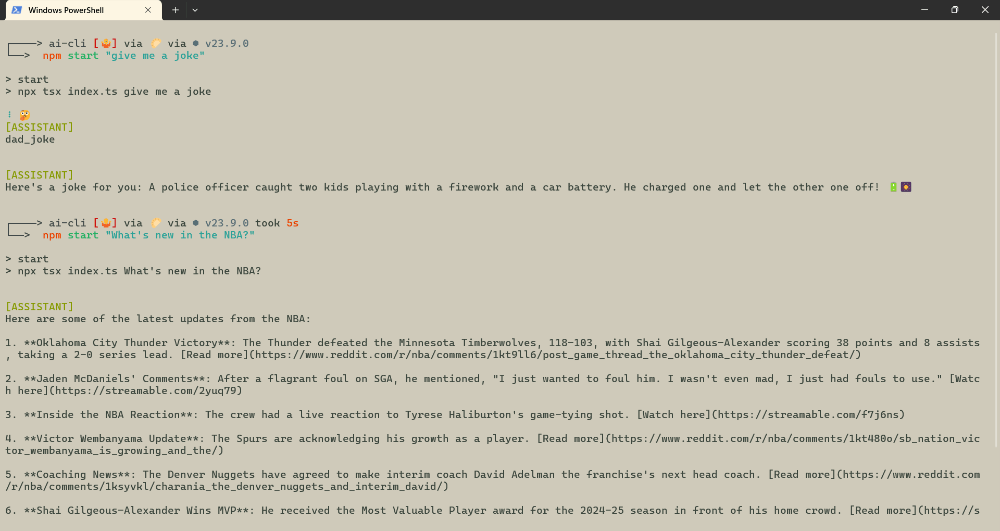

# AI CLI Agent

[](readme_src/vid.mp4/ 'Click to watch the demo')

I learned how to build this project from the **Build an AI Agent from Scratch** course on `Frontend Masters`.

I learned how to build my own AI agent from scratch! I learned how to create a command-line messaging interface that lets me chat with the agent in a continuous loop, just like having a real conversation. I learned how to make custom tools to fetch news, tell jokes, and generate images using the Dall-E API. I also learned how to manage chat history so every response feels natural and in context. Along the way, I explored modern design patterns and learned a lot about building agent-based API apps.

## Features

- **Fetch News from Reddit:**
  - Retrieve the latest news and trending posts from Reddit by fetching data from specified subreddits.
- **Fetch Jokes:**
  - Get and display random dad jokes for entertainment.
- **Generate Images with Dall-E:**
  - Create images from text prompts using the Dall-E API.
- **Continuous Agent Loop:**
  - The agent maintains a chat history and context, allowing for ongoing, interactive conversations.

These features demonstrate how to integrate external APIs, manage chat context, and build interactive command-line AI tools.

To install dependencies:

```bash
bun install or npm install
```

To run:

```bash
bun run index.ts or npm start
```

This project was created using `bun init` in bun v1.0.20. [Bun](https://bun.sh) is a fast all-in-one JavaScript runtime.
